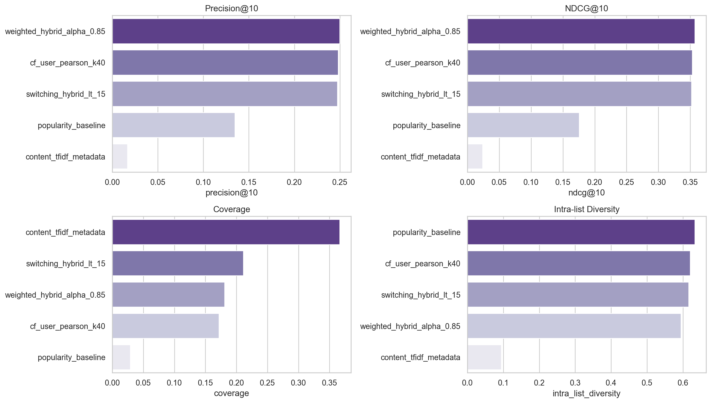
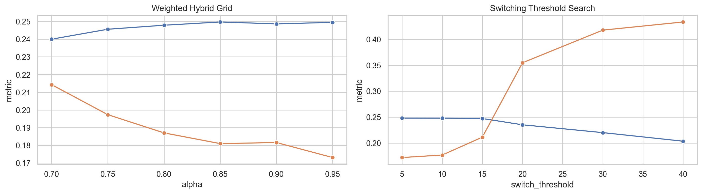
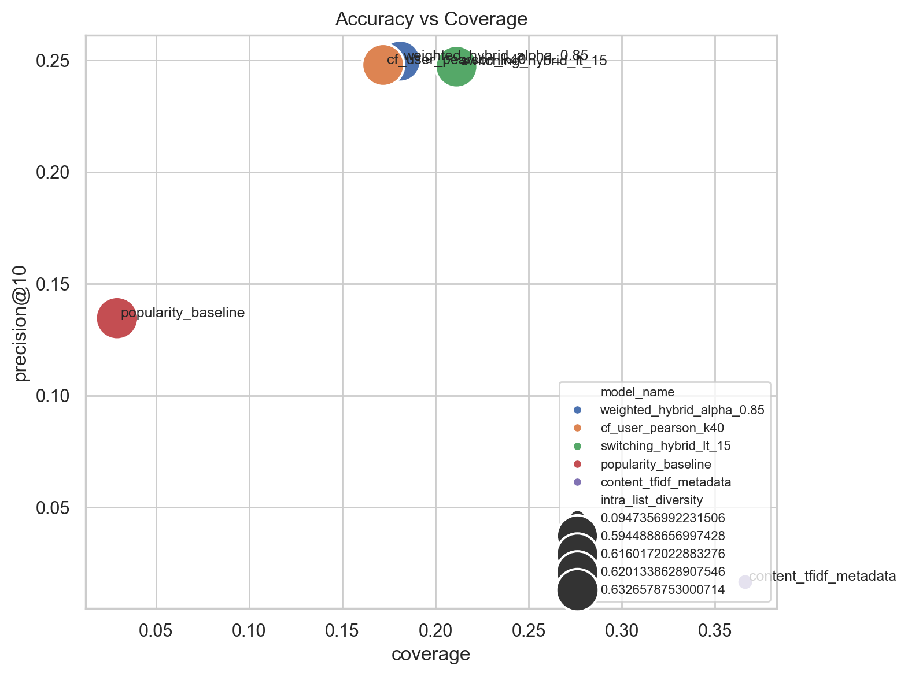
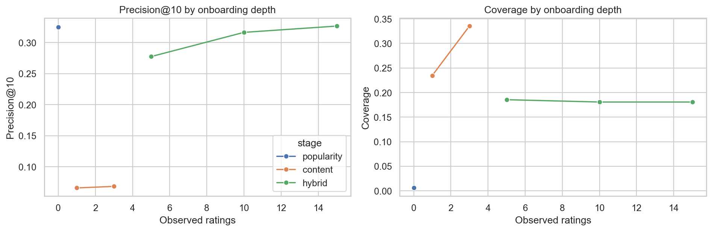

# RecSys Lab: 개인화 상품 추천 엔진

MovieLens 100K 기반으로 Collaborative Filtering, Content-Based Filtering, Hybrid 추천을 비교하고, Top-10 추천 품질과 cold-start 대응 전략, A/B 테스트 설계까지 연결한 포트폴리오 프로젝트입니다.

## 한 줄 요약

Weighted Hybrid가 전체 비교군 중 가장 높은 Top-10 랭킹 품질을 보였고, popularity baseline 대비 `Precision@10`을 `85.4%` 개선했습니다.

## Problem

인기도 기반 추천만으로는 유저별 취향 차이를 반영하기 어렵고, 신규 아이템은 충분한 노출을 얻기 어렵습니다. 이 프로젝트는 다음 질문에 답하는 것을 목표로 했습니다.

- 어떤 추천 접근이 Top-10 랭킹 품질에 가장 강한가
- 신규 유저와 신규 아이템은 어떤 fallback 전략이 필요한가
- offline metric을 실제 online 실험으로 어떻게 연결할 것인가

## Dataset

- Dataset: MovieLens 100K
- Ratings: 100,000
- Users: 943
- Items: 1,682
- Mean rating: 3.5299
- Sparsity: 93.70%

MovieLens 100K를 선택한 이유:

- 추천 시스템 포트폴리오에서 널리 쓰이는 표준 벤치마크라 결과 설명이 쉽습니다.
- 로컬 환경에서 빠르게 재현 가능하면서도 CF와 CB의 trade-off가 분명하게 드러납니다.
- 영화 메타데이터가 있어 cold-start item 대응까지 같이 설명하기 좋습니다.

## Tech Stack

`Python` · `pandas` · `NumPy` · `scikit-learn` · `SciPy` · `scikit-surprise` · `implicit` · `Matplotlib` · `Plotly` · `Streamlit`

## Approach

### 1. Collaborative Filtering

- Memory-based User-CF / Item-CF
- Surprise 기반 SVD / SVD++ / NMF
- implicit ALS

### 2. Content-Based Filtering

- 장르 one-hot / multi-hot
- release decade feature
- title token + genre + decade 기반 metadata TF-IDF
- 고평점 이력 기반 user profile

### 3. Hybrid

- Weighted Hybrid: CF score + CB score 가중 결합
- Switching Hybrid: sparse profile user에 content fallback
- cold-start 단계에서 popularity -> content -> hybrid 전환 시뮬레이션

## Visualizations

### 모델 비교 대시보드


### Hybrid Alpha Grid Search


### Precision vs Coverage Trade-off


### Cold-Start 온보딩 시뮬레이션


## Key Results

### 최종 모델 비교

| Model | Precision@10 | Recall@10 | NDCG@10 | MAP@10 | Coverage |
|---|---:|---:|---:|---:|---:|
| Weighted Hybrid (`alpha=0.85`) | 0.2497 | 0.2793 | 0.3571 | 0.2306 | 0.1810 |
| User-CF (`pearson`, `k=40`) | 0.2479 | 0.2780 | 0.3534 | 0.2265 | 0.1719 |
| Switching Hybrid (`<15 -> CB`) | 0.2473 | 0.2765 | 0.3519 | 0.2257 | 0.2094 |
| Popularity Baseline | 0.1347 | 0.1403 | 0.1755 | 0.0906 | 0.0291 |
| Content TF-IDF Metadata | 0.0172 | 0.0208 | 0.0239 | 0.0108 | 0.3686 |

### 결과 해석

- Weighted Hybrid는 전체 기준 최고 `Precision@10`과 `NDCG@10`을 기록했습니다.
- popularity baseline 대비:
  - `Precision@10` `+85.4%`
  - `NDCG@10` `+103.4%`
- Switching Hybrid는 User-CF 대비 precision은 비슷하게 유지하면서 coverage를 더 넓혔습니다.
- Content-Based TF-IDF는 정확도는 낮지만 신규 아이템 노출과 coverage에 강했습니다.

### Day 2 해석

- Top-K ranking 기준 최고 성능은 `user_cf_pearson_k80`이었습니다.
- best RMSE는 `svdpp_n_factors50_reg_all0.05`였지만 ranking 성능은 memory CF보다 낮았습니다.
- 즉, 이 데이터셋에서는 평점 예측 정확도와 추천 ranking 품질을 분리해서 해석해야 합니다.

## Cold-Start Insights

신규 유저 온보딩 시뮬레이션 결과:

| Observed Ratings | Stage | Precision@10 | Coverage |
|---|---|---:|---:|
| 0 | popularity | 0.3250 | 0.0059 |
| 1 | content | 0.0660 | 0.2348 |
| 3 | content | 0.0685 | 0.3353 |
| 5 | hybrid | 0.2775 | 0.1855 |
| 10 | hybrid | 0.3165 | 0.1807 |
| 15 | hybrid | 0.3266 | 0.1807 |

핵심 해석:

- 완전 cold-start 단계에서는 popularity가 가장 안정적입니다.
- 1~3개 평점 단계에서는 content fallback이 coverage를 넓히는 역할을 합니다.
- 약 10~15개 평점이 쌓이면 hybrid가 personalization을 회복합니다.
- 신규 아이템은 metadata가 있으면 Content-Based가 초기 노출 단계에 유리합니다.

## Offline to Online

이 프로젝트는 offline 성능표로 끝나지 않고 online 실험 설계까지 연결합니다.

- `Precision@10`, `NDCG@10` -> CTR, detail page entry 기대
- `Coverage`, `cold_start_item_share` -> catalog exploration, 신규 아이템 노출
- `Intra-list Diversity` -> 피로도와 편중 방지

자세한 내용은 [ab_test_design.md](./ab_test_design.md)에 정리했습니다.

## Streamlit Demo

실행:

```bash
pip install -r requirements.txt
streamlit run app.py
```

앱 구성:

- Tab 1: EDA
- Tab 2: 모델별 Top-10 추천 비교
- Tab 3: 유사 아이템 추천
- Tab 4: 모델 비교 대시보드
- Tab 5: Cold-start 시뮬레이션
- Tab 6: A/B 테스트 설계 요약

추가 페이지:

- `pages/1_methodology.py`
- `pages/2_portfolio_summary.py`

## Reproducibility

### 기본 환경

- Python 3.13에서도 앱과 기본 분석은 실행 가능합니다.
- 단, `scikit-surprise`, `implicit`는 Python 3.11 환경에서 실행하는 편이 안정적입니다.

### Day 2 전체 비교 재생성

```bash
uv venv .uv311 --python 3.11
uv pip install --python .uv311\Scripts\python.exe -r requirements.txt -r requirements-optional.txt
.uv311\Scripts\python.exe scripts\generate_day2_artifacts.py
```

### Day 5 cold-start 산출물 재생성

```bash
.uv311\Scripts\python.exe scripts\generate_day5_artifacts.py
```

### 노트북 실행 검증

```bash
.uv311\Scripts\jupyter-nbconvert.exe --to notebook --execute --ExecutePreprocessor.timeout=1200 --output 01_eda.executed.ipynb notebooks\01_eda.ipynb
.uv311\Scripts\jupyter-nbconvert.exe --to notebook --execute --ExecutePreprocessor.timeout=1200 --output 02_collaborative_filtering.executed.ipynb notebooks\02_collaborative_filtering.ipynb
.uv311\Scripts\jupyter-nbconvert.exe --to notebook --execute --ExecutePreprocessor.timeout=1200 --output 03_content_based.executed.ipynb notebooks\03_content_based.ipynb
.uv311\Scripts\jupyter-nbconvert.exe --to notebook --execute --ExecutePreprocessor.timeout=600 --output 04_hybrid.executed.ipynb notebooks\04_hybrid.ipynb
.uv311\Scripts\jupyter-nbconvert.exe --to notebook --execute --ExecutePreprocessor.timeout=600 --output 05_model_comparison.executed.ipynb notebooks\05_model_comparison.ipynb
.uv311\Scripts\jupyter-nbconvert.exe --to notebook --execute --ExecutePreprocessor.timeout=1200 --output 06_cold_start.executed.ipynb notebooks\06_cold_start.ipynb
```

6개 노트북 모두 executed 버전(`.executed.ipynb`)이 포함되어 있어 셀 출력을 바로 확인할 수 있습니다.

## Repository Structure

```text
.
├── app.py                          # Streamlit 메인 앱 (6개 탭)
├── pages/
│   ├── 1_methodology.py            # 방법론 상세 페이지
│   └── 2_portfolio_summary.py      # 포트폴리오 요약 페이지
├── notebooks/
│   ├── 01_eda.ipynb                # Day 1: 데이터 탐색 + 전처리
│   ├── 02_collaborative_filtering.ipynb  # Day 2: CF (User/Item-CF, SVD, ALS)
│   ├── 03_content_based.ipynb      # Day 3: Content-Based (TF-IDF, 장르)
│   ├── 04_hybrid.ipynb             # Day 4: Hybrid (Weighted, Switching)
│   ├── 05_model_comparison.ipynb   # Day 4: 전체 모델 비교
│   ├── 06_cold_start.ipynb         # Day 5: Cold-Start 시뮬레이션
│   └── *.executed.ipynb            # 실행 결과 포함 버전 (6개)
├── src/
│   ├── models/
│   │   ├── baseline.py             # 인기도 / 평균 기반 베이스라인
│   │   ├── collaborative.py        # User-CF, Item-CF, SVD, NMF, ALS
│   │   └── hybrid.py               # Weighted / Switching Hybrid
│   ├── evaluation/
│   │   ├── metrics.py              # Precision, Recall, NDCG, MAP, Coverage, Diversity
│   │   └── cold_start.py           # Cold-start 시뮬레이션 로직
│   ├── features/
│   │   └── content_based.py        # 장르 one-hot, TF-IDF, 유저 프로필
│   ├── data/
│   │   └── movielens.py            # MovieLens 100K 로드 / 다운로드
│   ├── app/
│   │   └── demo_data.py            # Streamlit 앱용 데모 데이터
│   └── config.py                   # 프로젝트 설정
├── scripts/
│   ├── generate_day2_artifacts.py  # Day 2 CF 산출물 일괄 생성
│   ├── generate_day5_artifacts.py  # Day 5 Cold-start 산출물 생성
│   └── smoke_test.py              # 전체 파이프라인 스모크 테스트
├── artifacts/
│   ├── figures/                    # 시각화 PNG (4개)
│   └── metrics/                    # 평가 결과 CSV/JSON (20개)
├── data/
│   ├── raw/                        # MovieLens 원본 (.gitignore)
│   └── processed/                  # 전처리 결과 (.gitignore)
├── ab_test_design.md               # A/B 테스트 설계 문서
├── portfolio_summary.md            # 포트폴리오 요약
├── requirements.txt                # 핵심 패키지
├── requirements-optional.txt       # scikit-surprise, implicit (Python 3.11)
└── task.md                         # 프로젝트 계획서
```

## Main Artifacts

### Notebooks (6개, 모두 executed 버전 포함)

| Notebook | Day | 내용 |
|---|---|---|
| `01_eda` | 1 | 평점 분포, 희소성 93.7%, Long-tail, 시간 트렌드, 베이스라인 |
| `02_collaborative_filtering` | 2 | User-CF, Item-CF, SVD, SVD++, NMF, ALS 비교 |
| `03_content_based` | 3 | 장르 one-hot, TF-IDF, 유저 프로필, 다양성 분석 |
| `04_hybrid` | 4 | Weighted / Switching Hybrid, alpha 그리드 서치 |
| `05_model_comparison` | 4 | 전체 모델 최종 비교표, 시나리오별 최적 모델 |
| `06_cold_start` | 5 | 신규 유저 온보딩 시뮬레이션, 전환 시점 분석 |

### Figures

- `day4_model_comparison_dashboard.png` — 전체 모델 성능 대시보드
- `day4_hybrid_grid.png` — Hybrid alpha 그리드 서치 결과
- `day4_model_tradeoff.png` — Precision vs Coverage 트레이드오프
- `day5_cold_start_transition.png` — Cold-start 온보딩 단계별 성능 변화

### Key Metrics (CSV/JSON 20개)

- `day1_overview.json` — 데이터셋 기본 통계
- `day2_collaborative_filtering_results.csv` — CF 모델 전체 비교
- `day3_content_based_results.csv` — CB 모델 결과
- `day4_model_comparison.csv` — 최종 모델 비교표
- `day5_cold_start_transition.csv` — 온보딩 시뮬레이션 결과
- `ab_test_design.md` — A/B 테스트 설계 (가설, 샘플 사이즈, Power Analysis)

## Portfolio Summary

### Problem

개인화 없는 인기 추천은 취향 반영과 신규 아이템 노출에 한계가 있습니다.

### Solution

CF, Content-Based, Hybrid를 같은 지표 체계에서 비교하고, cold-start 전환 전략과 A/B 테스트 설계까지 함께 제시했습니다.

### Impact

Weighted Hybrid가 baseline 대비 Top-10 랭킹 품질을 크게 개선했고, cold-start 대응 로직과 실험 설계를 함께 정리했습니다.

### Learning

RMSE와 ranking metric은 다른 문제를 푼다는 점, 그리고 추천 시스템에서는 offline metric만이 아니라 rollout 기준과 experiment design도 같이 보여줘야 한다는 점을 확인했습니다.

## Limitations

- MovieLens 100K는 실제 커머스 로그처럼 클릭, 장바구니, 구매 이벤트가 분리돼 있지 않습니다.
- 별도 tag table이 없어 content feature를 metadata TF-IDF로 근사했습니다.
- cold-start 평가는 pseudo-onboarding simulation이므로 실제 서비스 로그 기반 검증이 추가로 필요합니다.
- Neural CF는 이번 범위에서는 선택 과제로 남겨 두었습니다.

## Next Step

- session context 반영
- reranking / diversity-aware objective
- exploration-aware hybrid
- online experiment automation 연결
